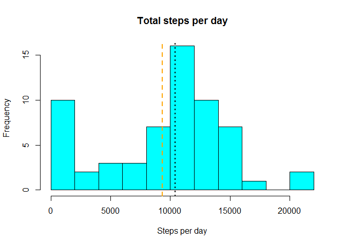
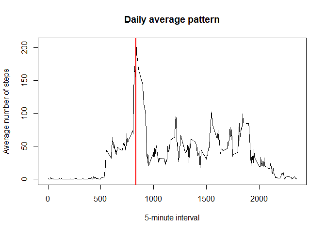
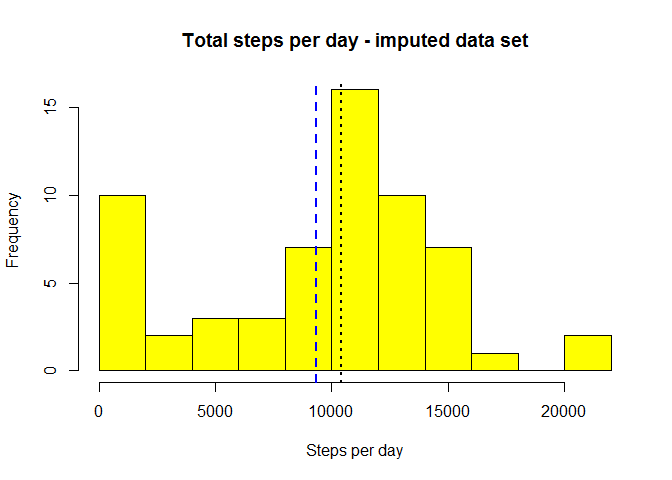
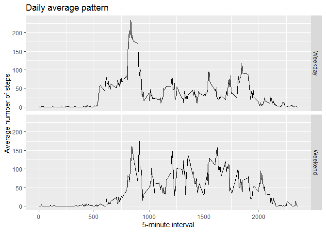

## Loading and preprocessing the data


```r
dat <- read.csv("activity.csv")
summary(dat)
```

## What is mean total number of steps taken per day?
The following plot shows a histogram with the distribution of the total steps per day

```r
totalsteps <- tapply(dat$steps,dat$date, sum, na.rm = TRUE)
hist(totalsteps, breaks = 10, col = "cyan", main = "Total steps per day", xlab = "Steps per day")
meanstep <- mean(totalsteps, na.rm = TRUE)
medianstep <- median(totalsteps, na.rm = TRUE)
abline(v = meanstep, col = "orange", lty =2, lwd =2)
abline(v = medianstep, lty = 3, lwd =2)
```

<!-- -->

```r
if(!file.exists("Figures")){dir.create("Figures")}
dev.copy(png, file = "./Figures/Total_steps_day.png")
dev.off()
```
    
The mean (orange vertical line in the plot) and median (black vertical line in the plot) of the total steps per day are 9354.2295082 steps and 10395 steps respectively.

## What is the average daily activity pattern?
Following there is a time series plot showing the 5-minute interval and the average number of steps taken, averaged across all days.


```r
meanstepsint <- tapply(dat$steps,dat$interval, mean, na.rm = TRUE)

int <- unique(dat$interval)
plot(x=int, y=as.numeric(meanstepsint), type = "l", xlab = "5-minute interval", ylab = "Average number of steps", main = "Daily average pattern")
wint <- int[which.max(meanstepsint)]
abline(v=wint, col = "red", lwd=2)
```

<!-- -->

```r
dev.copy(png, file = "./Figures/Daily_pattern.png")
dev.off()
```

The maximum number of steps is in the 835 5-minute interval, which is shown with the red vertical line in the plot.

## Imputing missing values


```r
totna <- sum(is.na(dat))
meanstepsint <- tapply(dat$steps,dat$interval, mean, na.rm = TRUE)
int <- unique(dat$interval)
meanstepsint <- cbind(int, meanstepsint)
dat2 <- dat
for(i in nrow(dat)) {
  if(is.na(dat[i,1]))  dat2[i,1] <- meanstepsint[which(int == dat[i,3]),2]
}

totalsteps2 <- tapply(dat2$steps,dat2$date, sum, na.rm = TRUE)
hist(totalsteps2, breaks = 10, col = "yellow", main = "Total steps per day - imputed data set", xlab = "Steps per day")
meanstep2 <- mean(totalsteps2, na.rm = TRUE)
medianstep2 <- median(totalsteps2, na.rm = TRUE)
abline(v = meanstep2, col = "blue", lty =2, lwd =2)
abline(v = medianstep2, lty = 3, lwd =2)
```

<!-- -->

```r
dev.copy(png, file = "./Figures/Tota_steps_day_imputed.png")
dev.off()

changemean <- 100*(meanstep2/meanstep-1)
changemedian <- 100*(medianstep2/medianstep-1)
```

There are 2304 missing values in the dataset.  All of the missing values are in the steps variable.

A new data set was created, where the na values were imputed using the mean for that 5-minute interval.  The histogram above shows the distribution of the total steps per day in the new dataset. The mean (blue vertical line in the plot) and median (black vertical line in the plot) of the total steps per day in the imputed data set are 9354.2471389 steps and 1.0395\times 10^{4} steps respectively.  By using the mean of the 5-minute interval, there is a 1.884782\times 10^{-4}% change in the mean and 0% change in the median with respect to the original data set.


## Are there differences in activity patterns between weekdays and weekends?
Following there is a time series plot showing the 5-minute interval and the average number of steps taken, averaged across all weekday days or weekend days.


```r
library(ggplot2)
```

```
## Warning: package 'ggplot2' was built under R version 3.6.3
```

```r
dat2$days <- as.factor(ifelse((weekdays(as.Date(dat2$date), abbreviate = TRUE)) %in% c("Sat", "Sun"), "Weekend", "Weekday"))

meanstepsint2 <- aggregate(steps ~ interval + days, data = dat2, FUN = "mean")

g <- ggplot(data = meanstepsint2, aes(x = interval, y = steps)) + 
geom_line() + facet_grid(days ~ .) + labs(x = "5-minute interval", y = "Average number of steps", title = "Daily average pattern")
print(g)
```

<!-- -->

```r
dev.copy(png, file = "./Figures/Average_steps_wdays_wend.png")
dev.off()
```
